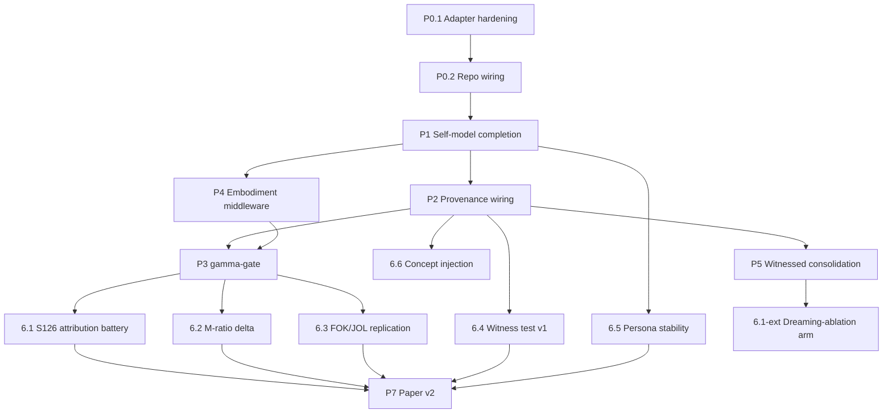

# PREREQUISITES & MEASUREMENT STANDARDS
## Companion to BUILD_PLAN.md v1.0 · Everything required BEFORE Phase 0 · Metric Canon verbatim
Date: 2026-08-24 · Rule: no component starts until its prerequisites row is green.

---

## PART A — ENVIRONMENT PREREQUISITES

### A.1 Runtime & toolchain

| item | requirement | verify command | status gate |
|---|---|---|---|
| Node + pnpm | node ≥20, pnpm ≥9 | `node --version && pnpm --version` | DSH plugins typecheck |
| Python | ≥3.11 | `python3 --version` | harness + experiments |
| pymc ≥5 | meta-d′ Bayesian fitting | `python3 -c "import pymc"` | Experiment 6.2 |
| sentence-transformers | embedding similarity (persona/mirroring) | `python3 -c "import sentence_transformers"` | P1.3, P1.4 |
| llama.cpp | NOT REQUIRED — removed by backend constraint | — | n/a |
| git | clean-tree discipline | `git -C ~/Desktop/mindharness status` | every commit |

### A.2 Credentials & access

| credential | purpose | known state | action before P0 |
|---|---|---|---|
| Groq API key | primary backend (gpt-oss-120b primary, qwen3 secondary) | present in `~/.local/share/opencode/auth.json` under `groq.key`; live | smoke call: `/models` + one completion; log fingerprint |
| Zen keys | backup backend | **KNOWN BROKEN: auth OK on /models, chat/completions returns 401** (CLI OAuth ≠ Zen API keys); requires billing setup at opencode.ai/auth | resolve OR declare Groq-only for v1 experiments (documented decision) |
| DIPPER-style paraphraser | stimulus creation for witness test (6.4) | none yet | pick: second Groq model as paraphraser (simplest, documented) — subject model NEVER paraphrases itself |
| TriviaQA subset | M-ratio item pool (6.2) | download ~2k items | hash + freeze item list at lock time |

### A.3 Repository state gates

```
[ ] ~/Desktop/mindharness        clean tree, latest ≥ c6265a0 (BUILD_PLAN committed)
[ ] tools/deepseek-harness      deps installed (pnpm install done previously)
[ ] plugins/self-model          dsh-self-model.ts present (committed 75d9fba)
[ ] plugins/cognitive-architecture  cordis.yml + index.ts present
[ ] pilot/prediction_lock.py    executable; produces SHA-256 lock files
```

---

## PART B — KNOWLEDGE PREREQUISITES (read-before-code contract)

No phase starts until its papers are read. Skimming does not count; each reader
session ends with a five-line summary appended to the phase's working notes.

| Phase | Must read (full text) | Why |
|---|---|---|
| P1 | dsh-goal sources: `packages/goal/goal/src/{types,fold,index}.ts`, `tool-goal/src/index.ts` | CAS pattern being mirrored |
| P1 | Choi et al. 2412.00804 §4–5 | consistency-probe design |
| P2 | Lederman & Mahowald 2603.05414 abstract+§1 | what "inference vs access" demands of our records |
| P3 | Cao et al. 2605.14186 full | FOK/JOL wiring being replicated |
| P3 | Macar et al. 2603.21396 §2 + Appendix A | exact prompts/metrics canon source |
| P4 | Sofroniew et al. 2604.07729 incl. appendix emotion list | affect representation |
| P5 | OpenClaw Dreaming docs + EverMemOS 2601.02163 §3 | consolidation lifecycle vocabulary |
| P6.2 | Maniscalco & Lau 2012 (+ Fleming & Lau 2014) | meta-d′ fitting procedure |
| P6.all | BUILD_PLAN §Metric Canon (below) verbatim | comparability contract |

---

## PART C — THE METRIC CANON (adopted VERBATIM; comparability contract)

> Contract: any number we publish uses these definitions, these formulas, these
> report formats. Deviations are forbidden without a written amendment in this file.

### C.1 Introspection battery metrics — Macar et al. 2603.21396 §2

```
Detection rate (TPR)       = P(report detect | injection present)
False positive rate (FPR)  = P(report detect | no injection)
Introspection rate         = P(detect AND identify correctly | injection)
Forced identification rate = P(identify correctly | prefill ∧ injection)
Discrimination validity    := TPR > FPR   (required, else result void)
```
Report format: `{TPR%, FPR%, introspection%, forced-ID%}` per arm, 95% bootstrap CI,
n_trials per cell. Judge = fixed LLM grader prompt, frozen at lock time.

### C.2 Metacognitive efficiency — Maniscalco & Lau via Cacioli 2603.25112

```
Type-1 d′        = Φ⁻¹(H₁) − Φ⁻¹(F₁)            (hit vs false-alarm rates, z-scores)
meta-d′          = MLE fit of Type-1 sensitivity implied by observed
                   Type-2 (confidence × correctness) distribution
M-ratio          = meta-d′ / d′                  (metacognitive efficiency)
M-diff           = meta-d′ − d′                  (report alongside ratio)
Confidence scale = verbal 1–4 (locked wording):
                 1 guess · 2 leaning · 3 confident · 4 certain
Fitting          = hierarchical Bayesian (pymc), 2000 draws ×4 chains, R-hat < 1.01
Report format    = {d′, meta-d′, M-ratio, M-diff} ± 95% HDI per arm
Adaptation note  : logprobs unavailable on Groq (verified) → verbal ratings ARE the
                   canonical instrument here (original psychophysics standard).
```

### C.3 Recognition accuracy — Panickssery et al. 2404.13076

```
Pairwise (PPP) accuracy     = P(correct pick among two candidates | authorship known)
Individual (IPP) accuracy   = P(correct yes/no | single text, balanced set)
Own-paraphrase detection    = P(flags paraphrase as own | DIPPER-paraphrase of own output)
Self-preference delta       = mean(score_own − score_other) on equal-quality pairs
Report format               = accuracies per paradigm per arm + confusion matrix
```

### C.4 Persona consistency — Choi et al. 2412.00804 benchmark

```
Consistency(t) = cosine(embedding(self_description_battery_t),
                        embedding(self_description_battery_baseline))
Battery        = 10 fixed questions (identity, preferences, boundaries, history),
                 administered every K=10 turns, answers ≤100 words each
Baseline       = first administration after SM creation (revision ≥1)
Drift event    = Consistency drop >0.30 within any 12-turn window (literature bar)
Report format  = consistency series per seed + turn-of-first-drift-event
Embedder       = frozen sentence-transformers model, name logged at lock time
```

### C.5 Programme-native metrics (defined here first)

```
Attribution accuracy = P(claimed source == recorded cause/provenance | audited claim)
                      graded against cause log + provenance records (S126 protocol)

Confidence inversion index (CII) = mean(confidence | fabricated claims)
                                 − mean(confidence | veridical claims)
                      S126 historical: +11pp (98 vs 87). Healthy target: ≤0.

γ (override rate)    = (# monitor episodes CHANGING next action)
                     / (# monitor episodes reaching diagnosis)
                      Format-compliance guard: forced-report-no-policy build MUST
                      yield γ=0; wired builds report γ per session with CI.

Mirroring rate       = fraction of 'action-outcome' facts flagged mirrored:true
                      (similarity > τ vs rolling user-context window; τ locked at 0.75
                       embedding cosine unless amended)
```

### C.6 Statistical discipline (all experiments)

- Seeds: ≥5 per arm minimum; report per-seed + pooled.
- Paired designs preferred (same items/tasks across arms); paired tests reported.
- CIs: 95% bootstrap (10k resamples) unless analytic form exists.
- Multiple comparisons: Holm correction across the pre-registered prediction set only.
- Null results are published in HANDOFF/FINDINGS like positives. No file-drawer.
- Prediction locks: SHA-256 over `{hypotheses[], metrics[], thresholds[], item hashes[],
  model fingerprints[]}` committed before first trial. Lock file path recorded in run
  manifest. Post-hoc analyses labeled EXPLORATORY in every table they appear in.

---

## PART D — DEPENDENCY GRAPH (explicit; nothing skips the queue)



Blocking rules:
- P3 cannot start before BOTH P2 (provenance exists to diagnose against) and P4
  (embodiment feeds Stage-1 anomaly score).
- Experiments cannot start before their phase's acceptance tests are green AND their
  prediction lock is committed.
- Paper results sections fill ONLY from locked-prediction experiments; exploratory
  analyses go to an explicitly-labeled appendix stream.

Parallel lanes permitted: {P4 ∥ P2}, {P5 ∥ P3}, {P7 writing ∥ anything}, {E2..E6 ∥ each
other} once P3 lands.

---

## PART E — ACCEPTANCE CRITERIA REGISTRY (checkable, not vibes)

| ID | Component | Criterion | Verification |
|---|---|---|---|
| AC-0.1a | Fingerprint capture | identical consecutive calls share system_fingerprint | scripted double-call diff |
| AC-0.1b | Capability matrix | per-arm structured-output mode documented | matrix file reviewed |
| AC-0.2 | Plugin boot | headless boot loads all six plugins; one smoke conversation completes | boot log + transcript |
| AC-1.1a | get/update tools | stale-ref update throws SELF_MODEL_REVISION_CONFLICT | unit test |
| AC-1.1b | Authority rules | external-write via tool path rejected; action-outcome requires recent tool event | unit tests |
| AC-1.1c | Narrative bound | overflow narrative raises SELF_MODEL_NARRATIVE_OVERFLOW | unit test |
| AC-1.2 | Verbatim anchor | post-compaction context contains byte-identical persona block | byte-diff test across simulated compaction |
| AC-1.3a | Drift instrumentation | RAW arm decay curve detectable (>0.30 by ~turn 12) | probe series plot + threshold check |
| AC-1.3b | Harnessed stability | harnessed arm <0.10 drift through 60 turns | same |
| AC-1.4 | Mirroring detector | planted user-echo fact flags mirrored:true; organic fact doesn't | synthetic pair test |
| AC-2.1 | Emission binding | ≥95% span coverage on 20-emission audit; memory spans cite ids | sampling audit script |
| AC-2.2a | Action-outcome hook | tool→proposal→confirm→revision chain increments cause-tagged revision | integration test |
| AC-2.2b | Compaction hook | exactly one narrative-summary revision; prior archived | integration test |
| AC-3.1 | Two-stage trigger | healthy <5% diagnose-rate; failure-streak >80% | injected-trajectory suite |
| AC-3.2a | Compliance guard | forced-report-no-policy build yields γ=0 exactly | regression test (permanent) |
| AC-3.2b | Wired overrides | wired build γ>0 on failure-injected trajectories | session logs |
| AC-3.3 | FOK/JOL presence | fields on 100% attempts; SDT-consumable schema | schema validation |
| AC-4.1a | Energy gating | energy<0.3 removes expensive strategies from proposal SET | proposal-diff test |
| AC-4.1b | Recovery | rest restores affordances | same |
| AC-4.2 | Affect bias | failure-run shifts salience ordering; multipliers bounded/saturating | ordered-list comparison |
| AC-5.1 | Cause-tag invariant | 100% promotions carry cause ∈ enum | hard assert in DEEP writer |
| AC-5.2 | Utility gate | candidate promoted only after ≥2 distinct query-type hits or endorsement | gate unit test |
| AC-5.3 | Ablation switch | REM-off observably reduces generalized concepts | consolidation diff |
| AC-E* | Each experiment | lock file committed BEFORE first trial; manifest lists fingerprints/seeds | lock-hash vs manifest check |

A criterion is green only when its verification artifact (test output, log, diff, plot)
is committed alongside the claim. "Should work" is not a state.

---

## PART F — RUN DISCIPLINE CHECKLIST (per experiment execution)

```
[ ] prediction_lock.py run; lock-hash recorded
[ ] item pool hashed; count confirmed vs lock
[ ] model(s) + capability mode recorded; fingerprint captured at start
[ ] seeds enumerated; per-arm assignment logged
[x] AMENDED 2026-08-24: Groq rotates system_fingerprint routinely (two fps observed within one minute live). Default=record-as-deviation (manifest lists fingerprints[] + deviations[]); strict_fingerprint=True re-enables hard abort.
[ ] raw + harnessed arms identical except declared harness components
[ ] outputs stored raw (no curation at collection time)
[ ] analysis notebook runs top-to-bottom from stored outputs
[ ] results table uses Part-C metric names/formats exactly
[ ] deviations from plan noted in DEVIATIONS.md section of run dir
```

---

*This file amends BUILD_PLAN.md where more specific. Amendments require a commit that
quotes the changed line. The canon is the canon.*
